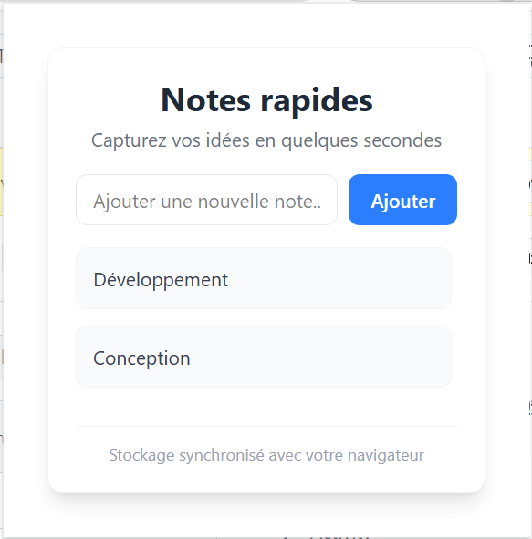

# Simple Notes - Extension Chrome

Simple Notes est une extension Chrome développée avec **React**, **TypeScript**, et **Vite**. Elle permet aux utilisateurs de créer, afficher et supprimer des notes simples, tout en synchronisant les données avec le stockage Chrome.

---

## Fonctionnalités

- **Ajout de notes** : Les utilisateurs peuvent ajouter des notes rapidement en saisissant du texte et en appuyant sur "Entrée" ou le bouton "Ajouter".
- **Suppression de notes** : Chaque note peut être supprimée individuellement.
- **Stockage synchronisé** : Les notes sont sauvegardées dans le stockage synchronisé de Chrome, permettant de les retrouver sur plusieurs appareils connectés au même compte Google.
- **Interface utilisateur moderne** : L'interface est conçue avec **TailwindCSS**, offrant une expérience utilisateur fluide et responsive.

---

## Aperçu de l'interface



---

## Installation et exécution

### Prérequis

- **Node.js** (version 16 ou supérieure)
- **npm** ou **yarn**
- **Google Chrome**

### Étapes

1. **Cloner le dépôt** :
   ```bash
   git clone https://github.com/enismermer/simple-notes
   cd simple-notes
   ```

2. **Installer les dépendances** :
   ```bash
   npm install
   ```

3. **Lancer le projet en mode développement** :
   ```bash
   npm run dev
   ```

4. **Construire le projet pour la production** :
   ```bash
   npm run build
   ```

5. **Charger l'extension dans Chrome** :
   - Construisez le projet avec `npm run build`.
   - Ouvrez Chrome et accédez à `chrome://extensions`.
   - Activez le mode développeur.
   - Cliquez sur "Charger l'extension non empaquetée" et sélectionnez le dossier `dist`.

---

## Structure du projet

Voici un aperçu de la structure des fichiers principaux :

```
simple-notes/
├── public/
│   └── manifest.json  # Déclaration de l'extension Chrome
├── src/
│   ├── App.tsx        # Composant principal de l'application
│   ├── main.tsx       # Point d'entrée de l'application
│   ├── index.css      # Styles globaux avec TailwindCSS
│   └── assets/        # Ressources statiques
├── package.json       # Dépendances et scripts
├── vite.config.ts     # Configuration de Vite
├── tsconfig.json      # Configuration TypeScript
└── README.md          # Documentation
```

---

## Fonctionnement technique

### 1. **Stockage des données**
L'application utilise l'API `chrome.storage.sync` pour sauvegarder et synchroniser les notes. Voici les principales étapes :
- **Chargement des notes** : Lors du montage du composant, les notes sont récupérées depuis le stockage Chrome.
- **Sauvegarde automatique** : À chaque modification de la liste des notes, les données sont automatiquement mises à jour dans le stockage.

### 2. **Composant principal**
Le composant [`App.tsx`](src/App.tsx) gère toute la logique de l'application :
- **État local** : Utilisation de `useState` pour gérer les notes et le texte de saisie.
- **Effets** : Utilisation de `useEffect` pour synchroniser les données avec le stockage Chrome.
- **Gestion des événements** : Ajout de notes via un champ de saisie et suppression via un bouton.

### 3. **Styles**
Les styles sont définis avec **TailwindCSS**, ce qui permet une personnalisation rapide et une interface moderne.

---

## Points techniques importants pour les développeurs

- **TypeScript** : Le projet utilise TypeScript pour une meilleure sécurité des types et une documentation implicite du code.
- **Vite** : Utilisé pour le bundling et le développement rapide grâce à son serveur de développement performant.
- **React** : Permet de structurer l'application en composants réutilisables.
- **API Chrome** : L'extension utilise l'API `chrome.storage.sync` pour gérer les données.

---

## Points à mettre en avant pour les recruteurs

- **Architecture moderne** : Le projet suit les bonnes pratiques de développement avec des outils modernes comme React, TypeScript, et Vite.
- **Code maintenable** : Le code est organisé, typé, et documenté, ce qui facilite la maintenance et l'évolution.
- **Focus sur l'expérience utilisateur** : L'interface est intuitive, responsive, et conçue avec une attention particulière aux détails.
- **Utilisation des APIs Chrome** : Le projet montre une maîtrise des extensions Chrome et de leur intégration avec React.

---

## Améliorations possibles

- Ajouter une fonctionnalité de recherche pour filtrer les notes.
- Permettre la modification des notes existantes.
- Ajouter des tests unitaires et des tests d'intégration.
- Permettre l'exportation/importation des notes au format JSON.

---

## Licence

Ce projet est sous licence MIT. Vous êtes libre de l'utiliser, de le modifier et de le distribuer.

---

## Auteur

Développé par **Enis**. N'hésitez pas à me contacter pour toute question ou opportunité !